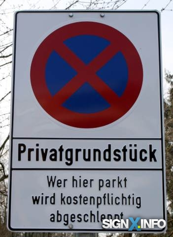
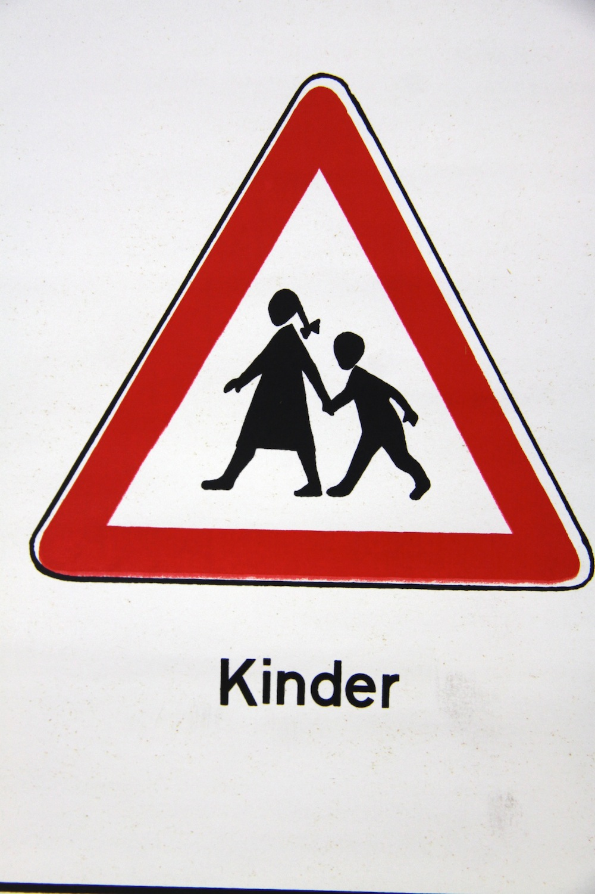
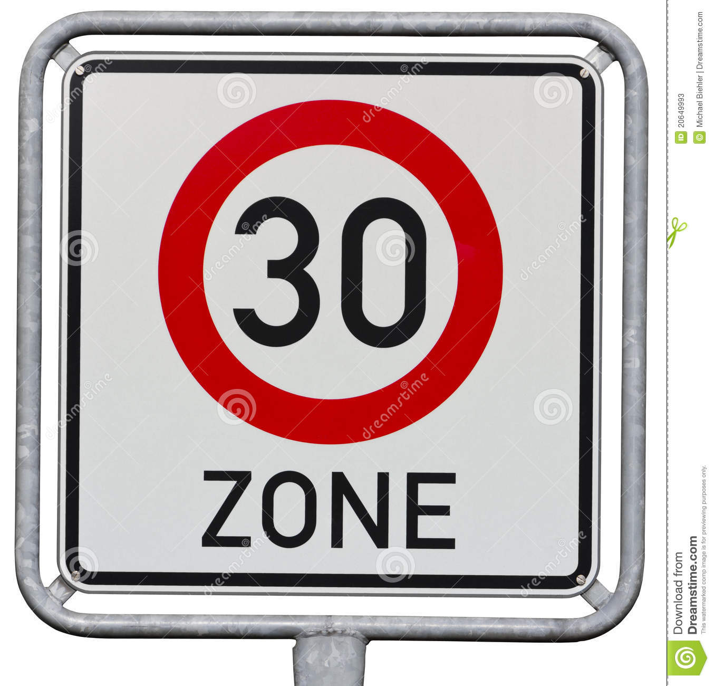
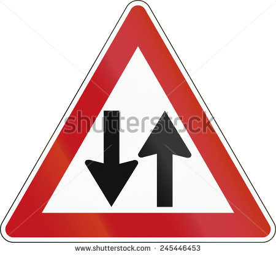

[//]: # (Image References)

[image9]: ./traffic_sign_distribution.png "Traffic sign distribution"
[image10]: ./flipping.png "Flipping"
[image11]: ./color_shifting.png "Color shifting"
[image12]: ./random_crop.png "random crop"
[image13]: ./traning_process.png "training_process"
[image14]: ./features_map.png "features_map"

### Data Set Summary & Exploration

#### 1. Basic summary of the data set

I used the pandas library to calculate summary statistics of the traffic
signs data set:

* The size of training set is 34799
* The size of the validation set is 4410
* The size of test set is 12630
* The shape of a traffic sign image is (32, 32, 3)
* The number of unique classes/labels in the data set is 43

#### 2. Exploratory visualization of the dataset.

Here is an exploratory visualization of the data set. It is a bar chart showing how the data distribute

![alt text][image9]

I saw that this ia a uneven distribution.

### Design and Test a Model Architecture

#### 1. Preprocess the image data. 

As a first step, I decided not to convert the images to grayscale because as I know different color has different meaning for the traffic sign.Such as red for attention, yellow for warnning, blue for tips.

Then I prefer to scale the pixels between 0.0 and 1.0, or say normalized the image data so that these data's dimensions can share a similar distribution, also this step can make these data center on a certain position(say 0.5, 0.5).

As at last step, I one-hot the labels on train and validation dataset.

I decided to generate additional data because more data can make the model fit better.

To add more data to the the data set, I used the following techniques because it's very difficult to collect road sign images with labels. And this technique is data augmentation, such as flipping, color shifting, or random cropping.

Here is an example of an original image and an augmented image:
![alt text][image10]
![alt text][image11]
![alt text][image12]

I decided to use the flipping one to augment the train data, with these augmented data, the training examples number is now 69598.

#### 2. Final model architecture.

My final model consisted of the following layers:

<pre>
_________________________________________________________________
Layer (type)                 Output Shape              Param #   
=================================================================
conv2d_25 (Conv2D)           (None, 32, 32, 32)        896       
_________________________________________________________________
conv2d_26 (Conv2D)           (None, 32, 32, 32)        9248      
_________________________________________________________________
max_pooling2d_13 (MaxPooling (None, 16, 16, 32)        0         
_________________________________________________________________
conv2d_27 (Conv2D)           (None, 16, 16, 64)        18496     
_________________________________________________________________
conv2d_28 (Conv2D)           (None, 16, 16, 64)        36928     
_________________________________________________________________
max_pooling2d_14 (MaxPooling (None, 8, 8, 64)          0         
_________________________________________________________________
conv2d_29 (Conv2D)           (None, 8, 8, 128)         73856     
_________________________________________________________________
conv2d_30 (Conv2D)           (None, 8, 8, 128)         147584    
_________________________________________________________________
max_pooling2d_15 (MaxPooling (None, 4, 4, 128)         0         
_________________________________________________________________
conv2d_31 (Conv2D)           (None, 4, 4, 256)         295168    
_________________________________________________________________
conv2d_32 (Conv2D)           (None, 4, 4, 256)         590080    
_________________________________________________________________
max_pooling2d_16 (MaxPooling (None, 2, 2, 256)         0         
_________________________________________________________________
flatten_4 (Flatten)          (None, 1024)              0         
_________________________________________________________________
dense_10 (Dense)             (None, 256)               262400    
_________________________________________________________________
dropout_7 (Dropout)          (None, 256)               0         
_________________________________________________________________
dense_11 (Dense)             (None, 256)               65792     
_________________________________________________________________
dropout_8 (Dropout)          (None, 256)               0         
_________________________________________________________________
dense_12 (Dense)             (None, 43)                11051     
_________________________________________________________________
activation_4 (Activation)    (None, 43)                0         
=================================================================
Total params: 1,511,499
Trainable params: 1,511,499
Non-trainable params: 0
_________________________________________________________________
 
</pre>

#### 3. Model training.

To train the model, I used an optimizer call RMSprop with learning rate 0.0004, and the batch size is 32, number of epochs is 16.

#### 4. Solutions.

My final model results were:
* training set accuracy of 0.99
* validation set accuracy of 0.9313 
* test set accuracy of 0.8754

I first try to train on a simple model, here is the architecture:

<pre>
Layer (type)                 Output Shape              Param #   
=================================================================
conv2d_4 (Conv2D)            (None, 32, 32, 32)        6176      
_________________________________________________________________
max_pooling2d_3 (MaxPooling2 (None, 16, 16, 32)        0         
_________________________________________________________________
dropout_6 (Dropout)          (None, 16, 16, 32)        0         
_________________________________________________________________
conv2d_5 (Conv2D)            (None, 16, 16, 16)        8208      
_________________________________________________________________
max_pooling2d_4 (MaxPooling2 (None, 8, 8, 16)          0         
_________________________________________________________________
dropout_7 (Dropout)          (None, 8, 8, 16)          0         
_________________________________________________________________
flatten_2 (Flatten)          (None, 1024)              0         
_________________________________________________________________
dense_4 (Dense)              (None, 512)               524800    
_________________________________________________________________
dropout_8 (Dropout)          (None, 512)               0         
_________________________________________________________________
dense_5 (Dense)              (None, 256)               131328    
_________________________________________________________________
dropout_9 (Dropout)          (None, 256)               0         
_________________________________________________________________
dense_6 (Dense)              (None, 64)                16448     
_________________________________________________________________
dropout_10 (Dropout)         (None, 64)                0         
_________________________________________________________________
dense_7 (Dense)              (None, 43)                2795      
_________________________________________________________________
activation_1 (Activation)    (None, 43)                0         
=================================================================
Total params: 689,755
Trainable params: 689,755
Non-trainable params: 0
_________________________________________________________________
</pre>

This architecture has 2 convolutional layer, and each layer is followed by a pooling layer and a dropout to prevent overfit, it seems ok but the result it terrible, I only got a accuracy of 0.3109 over 16 epoches, and it's not convergence yet, this means I need more training on this architecture, so I decided to train more epoches on this model.

After 32 epoches, the accuracy of validation dataset on this model is up to 0.3853, it's too slow, and still not convergence yet, so I decided to imrove the learning rate.

And then I found that the model still not convergence, So I realized that this simple model is not good enough to fit the dataset, so I decided to imrove the CNN model.

At last I quadruple the convolutional layers up to 8, and every two convolutaional layers followed by a max pooling layer, to prevent overfit, I add two dropout followed by the faltten layer, this model got a accuracy 0.9313 for the validation dataset after data aumentation.

![alt text][image13]

### Test a Model on New Images

#### 1. German traffic signs found on the web.

Here are five German traffic signs that I found on the web:

The first image might be difficult to classify because these are so many useless infomation around the road sign.

The second image might be easy to classify because almost no useless infomation around the road sign, and it's a very clear image.

The third image might be easy to cassify, but this is a historic traffic road sign before 1992, I have no historic traffic road signs training data to train, so the model maynot identify this sign.

The fourth image might be difficult to identify because it seems that is't not a standard modern road sign on earth.

The last image might be difficult to identify because the road sign is cover by something, that thing will make the model confused.

#### 2. The model's predictions on these new traffic signs.

Here are the results of the prediction:

| Image			        |     Prediction	        					| 
|:---------------------:|:---------------------------------------------:| 
| No Stopping      		| Slippery road   									| 
| Right-of-way at the next intersection     			| Right-of-way at the next intersection 										|
| Children					| Bicyclies crossing											|
| Start of a 30 km/h zone	      		| Keep right					 				|
| Two way traffic ahead		| Pedestrians      							|

The model was able to correctly guess 1 of the 5 traffic signs, which gives an accuracy of 20%. This compares terrible to the accuracy on the test set of 0.8754.

#### 3. Watch the softmax probabilities for each prediction.

The code for making predictions on my final model is located in the very last cell of the Ipython notebook.

For the first image, the model is relatively sure that this is a Slippery roadStop sign (probability of 0.9403), and it do look like a stop sign, but unfortunately it is not a Slippery roadStop sign, it's a No stopping sign.

Photo 1

| Probability | Prediction | 
|:---------------------:|:---------------------------------------------:| 
|0.9403|Slippery roadStop sign|
|0.0251|Speed limit (50km/h)Stop sign|
|0.012|Bicycles crossingStop sign|

For the second image, the model is relatively sure that this is a Right-of-way at the next intersectionStop sign(probability of 0.9992), and yes it's a Right-of-way at the next intersectionStop sign.

Photo 2

| Probability | Prediction | 
|:---------------------:|:---------------------------------------------:| 
|0.9992|Right-of-way at the next intersectionStop sign|
|0.0008|Double curveStop sign|
|0.0|PedestriansStop sign|

For the third image, the model is not very sure if it's a Bicycles crossingStop sign(probability 0.4486) or a Children crossingStop sign(probability 0.4253), the model seem to prefer the first choice, but the right answer is the second.

Photo 3

| Probability | Prediction | 
|:---------------------:|:---------------------------------------------:| 
|0.4486|Bicycles crossingStop sign|
|0.4253|Children crossingStop sign|
|0.0502|Speed limit (20km/h)Stop sign|

For the fourth image, the model is relatively sure that this is a Keep rightStop sign, but it's not. It's a Start of a 30 km/h zone sign.

Photo 4

| Probability | Prediction | 
|:---------------------:|:---------------------------------------------:| 
|0.9899|Keep rightStop sign|
|0.0042|Go straight or leftStop sign|
|0.0031|Keep leftStop sign|

For the last image, the model cannot tell what this sign it is, because all the top 3 probabilities is less than 10%.

Photo 5

| Probability | Prediction | 
|:---------------------:|:---------------------------------------------:| 
|0.0837|PedestriansStop sign|
|0.0832|Beware of ice/snowStop sign|
|0.0825|Road workStop sign|

### Visualizing the Neural Network 
#### 1. The visual output of the trained network's feature maps.
![alt text][image14]
